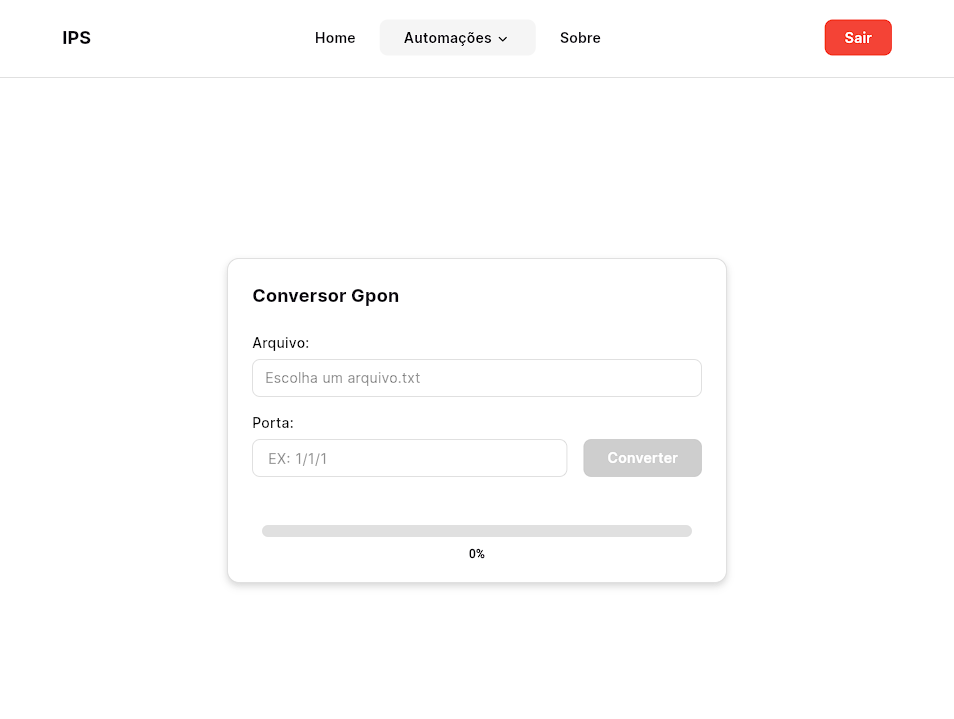

# 🦋 Network Automation Front

> **Modern Flutter Web interface for enterprise-grade telecom network automation**

A responsive and scalable **Flutter Web frontend** designed to integrate with backend automation services used in telecom network operations.

<div align="center">
  
</div>

## Getting Started

### 1️⃣ Clone the repository

```bash
git clone https://github.com/AppRonin/network-automation-front.git
cd network-automation-front
```

### 2️⃣ Install dependencies

```bash
flutter pub get
```

### 3️⃣ Run the application (Web)

```bash
flutter run -d web-server --web-port=5173
```

## Author

Developed by **AppRonin**, Full-Stack Developer.
